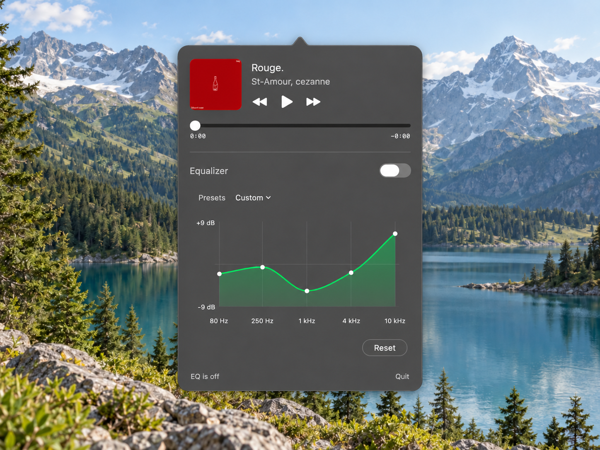

# Spotify Menu EQ

I wanted to change Spotify's EQ without having to open the app every time.
So I built a companion that stays connected to Spotify and lets me adjust the sound directly from my Mac's menu bar.



## Features

- Five-band equalizer with six presets and custom adjustments.
- Playback controls, seeking, track information, and album artwork.
- Saved EQ settings between launches.
- Native Swift and SwiftUI app with no third-party runtime dependencies.

## Get started

You'll need an **Apple silicon Mac with macOS 14.4+**, the **Spotify desktop app**, and an installed **Xcode toolchain**.

```sh
git clone https://github.com/Omerm10/spotify-menu-eq.git
cd spotify-menu-eq
zsh build.sh release
open "Spotify Menu EQ.app"
```

Start playing music in Spotify, click the waveform icon in your menu bar, and turn on EQ.
Choose a preset or adjust the bands to your liking.
Approve macOS permissions for Spotify control and system audio capture when prompted.
If access is denied, review **System Settings > Privacy & Security**.

The menu-bar icon hides when Spotify closes.
Reopen Spotify Menu EQ to show its controls again.
If EQ fails after permissions or output changes, turn it off and on to retry.

## Project status

This is an early source release, and I'm still refining the UI.
Build locally for now; a signed, notarized app download is planned.
Intel Macs and the Spotify web player are not currently supported, and hardware testing is still limited.

## Contributing

Contributions and bug reports are welcome.
Run the tests with `zsh test.sh` and see [CONTRIBUTING.md](CONTRIBUTING.md) for details.
The [validation record](docs/VALIDATION.md) and [UI integration notes](docs/UI-INTEGRATION.md) cover testing and ongoing development.

## License

[MIT](LICENSE). Copyright (c) 2026 Omerm10.

Independent project, not affiliated with or endorsed by Spotify.
